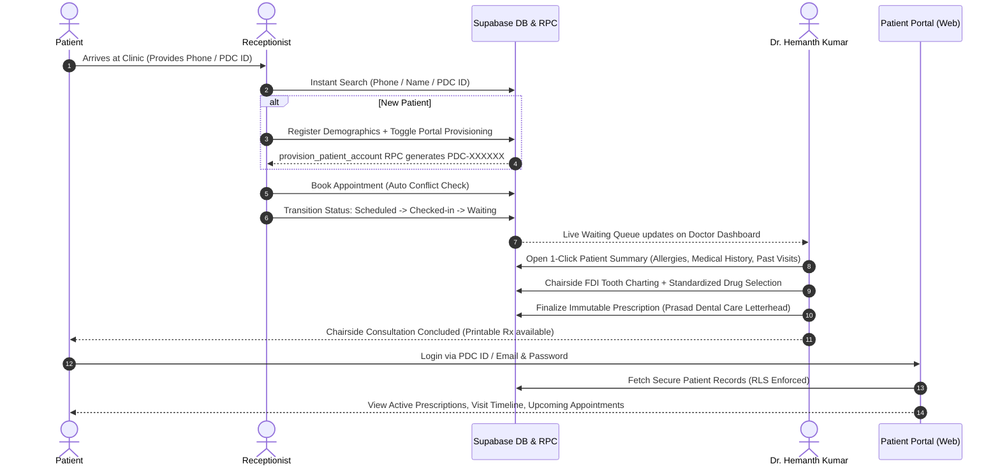

# BPMN 2.0 Clinical & Operational Workflows
## Prasad Dental Care HMIS (Hospital Management Information System)
**Academic Context:** PGDM Hospital & Health Management / HIT709 Field Project  
**Healthcare Provider:** Prasad Dental Care, Kurnool, Andhra Pradesh  
**Lead Doctor:** Dr. Hemanth Kumar, BDS, MDS – Orthodontics  
**Document Classification:** Evidence-Based Workflow Analysis  

---

## 1. Executive Summary & Purpose

The objective of this workflow analysis is to examine the clinical, administrative, and patient-facing processes of a single-doctor dental and orthodontic specialty clinic (**Prasad Dental Care**, Kurnool, AP). 

By contrasting the **Current State (AS-IS)** manual paper-based workflow with the **Proposed State (TO-BE)** digital workflow enabled by the custom **Prasad Dental Care HMIS**, this document identifies operational friction, patient waiting bottlenecks, clinical documentation risks, and medication dispensing hazards, and provides concrete digital interventions supported by the implemented application.

---

## 2. Process Actors & Swimlanes

| Actor / Swimlane | Role in AS-IS (Current State) | Role in TO-BE (Prasad Dental Care HMIS) |
| :--- | :--- | :--- |
| **Patient** | Arrives as walk-in or calls phone; waits passively without queue visibility; receives physical paper Rx slip; loses Rx easily. | Self-identifies via Mobile or `PDC-XXXXXX` ID; receives real-time queue visibility; accesses 24/7 digital portal for appointments and prescriptions. |
| **Receptionist (Staff)** | Manually searches physical paper register & folders; writes paper tokens; manually manages waiting room; no conflict detection. | Instant search (<1s) by Phone/PDC ID/Name; atomic patient registration with sequential `PDC-XXXXXX` ID; automated slot conflict check; live queue tracking. |
| **Doctor (Dr. Hemanth Kumar)**| Relies on verbal patient recall and physical paper notes; manually writes diagnoses and paper prescriptions; handwriting variability. | 1-click chairside clinical summary; visual FDI tooth charting; standardized dental formulary; generates tamper-proof immutable digital Rx. |
| **Pharmacy / Home** | Pharmacist deciphers handwritten slip; patient takes paper home; zero digital record access; high loss rate. | Clean, standardized, printable letterhead with Dr. Hemanth Kumar's credentials; digital record preserved indefinitely in Supabase PostgreSQL database. |

---

## 3. Primary Operational Problem Statement

```
[Operational Bottleneck]
In the current manual workflow, physical patient file retrieval and paper daybook registers at reception create 5–10 minute check-in delays per patient, appointment double-bookings, and lack of live queue transparency. 

[Clinical & Patient Risk]
Chairside orthodontic evaluations require accurate recall of historical bracket placements, wire gauges, and past diagnoses; paper notes are frequently fragmented or missing. Handwritten paper prescriptions pose deciphering risks for pharmacists and are frequently lost by patients after clinic departure, resulting in zero post-consultation treatment adherence tracking.
```

---

## 4. Current State Workflow (AS-IS)

### 4.1 Step-by-Step Execution
1. **Patient Arrival:** Patient walks in or calls over phone to seek an appointment or emergency consultation.
2. **Paper Record Search:** Receptionist opens physical daybook register and walks to storage shelves to find the patient's paper folder.
   - *Friction Point:* If folders are misfiled or damaged, search takes 5–10 minutes, generating reception congestion.
3. **Manual Token & Entry:** Receptionist writes patient name and contact in register, issuing a manual paper token.
4. **Unmanaged Waiting:** Patient sits in physical waiting room. There is no status display or estimated wait time; receptionists shout names verbally.
5. **Verbal History Recall:** Patient enters consultation room. Dr. Hemanth Kumar verbally questions the patient regarding past dental history, systemic allergies, and recent orthodontic adjustments.
6. **Chairside Dental Exam:** Oral examination is conducted; doctor writes freehand notes on paper card.
7. **Handwritten Prescription:** Doctor writes drug names, dosages, and instructions by hand on clinic prescription pad.
8. **Pharmacy Dispensing:** Patient takes handwritten slip to local pharmacy; pharmacist must decipher handwriting.
9. **Post-Visit Record Void:** Patient returns home with paper slip. If lost, patient has no way to review medication schedule or verify follow-up dates.

### 4.2 Documented AS-IS Pain Points

| Pain Point ID | Stage | Description | Impact | Evidence Classification |
| :--- | :--- | :--- | :--- | :--- |
| **PP-01** | Reception | Misplaced or damaged paper files | 5–10 min delay per patient; reception congestion | **[C]** Workflow Analysis |
| **PP-02** | Scheduling | Absence of digital slot conflict checking | Overlapping bookings for Dr. Hemanth Kumar | **[A]** Application Implemented Conflict Check |
| **PP-03** | Waiting Area | No queue visibility | Patient anxiety, noisy verbal announcements | **[C]** Small Clinic Operational Study |
| **PP-04** | Consultation | Disconnected past treatment notes | Repetitive questioning, missing orthodontic adjustment history | **[C]** Clinical Workflow Analysis |
| **PP-05** | Prescription | Handwritten paper Rx | Pharmacist dispensing ambiguity, medication errors | **[B]** Database Constraint & Master Catalog |
| **PP-06** | Patient Portal | Zero patient self-service | Patient loses paper Rx, cannot check instructions | **[A]** Patient Portal Implementation |

---

## 5. Proposed State Workflow (TO-BE)

### 5.1 Step-by-Step Digital Execution (Prasad Dental Care HMIS)



### 5.2 Digital Interventions & Value Delivered

1. **Instant Identification & Atomic Provisioning:**
   - Multi-parameter search queries indexed `patients` table by phone, name, or `patient_id` in milliseconds.
   - Atomic database RPC `provision_patient_account` creates the clinical patient record and authentication credentials simultaneously, allocating sequential `PDC-XXXXXX` IDs via `patient_id_seq`.
2. **Conflict-Free Scheduling & Real-Time Queue:**
   - Appointment service inspects active bookings for Dr. Hemanth Kumar; prevents duplicate time slots.
   - Status transitions (`scheduled` &rarr; `checked-in` &rarr; `waiting` &rarr; `in-consultation` &rarr; `completed`) keep reception and doctor synchronized.
3. **Structured Dental Documentation & FDI Tooth Charting:**
   - Visual tooth-level charting records FDI notation (teeth 11–48), findings (Caries, Mobility, Fracture, Orthodontic appliance status), and severity.
4. **Standardized Master Drug Formulary & Immutability:**
   - Standard dental drug formulary (`med_01`–`med_21`) auto-populates route, dosage, frequency, and food relation.
   - Immutable PostgreSQL database rules (`rx_no_update`, `rx_no_delete`) guarantee finalized prescriptions cannot be altered or falsified.
5. **Patient Self-Service Access:**
   - Patient portal provides 24/7 access to past consultations, upcoming appointments, and downloadable/printable prescriptions bearing Prasad Dental Care clinic branding and Dr. Hemanth Kumar’s credentials.

---

## 6. Traceability Matrix: Pain Points vs. HMIS Solutions

| Pain Point | AS-IS Manual Limitation | HMIS Digital Solution | Implementation Status | Evidence Source |
| :--- | :--- | :--- | :--- | :--- |
| **PP-01: File Retrieval** | Physical paper folders on shelves | PostgreSQL indexed search (<1s) by PDC ID / Phone | **COMPLETE** | `src/features/reception/PatientSearch.tsx` |
| **PP-02: Slot Conflicts** | Overlapping paper daybook notes | `simulateSlotCheck` / DB time slot query | **COMPLETE** | `src/services/appointmentService.ts` |
| **PP-03: Queue Chaos** | Verbal shouting of names | Real-time queue tracker with status badges | **COMPLETE** | `src/features/reception/AppointmentQueue.tsx` |
| **PP-04: History Gaps** | Verbal recall & fragmented cards | Centralized timeline with tooth findings | **COMPLETE** | `src/features/doctor/PatientSummary.tsx` |
| **PP-05: Handwritten Rx** | Illegible paper prescription pad | Standardized formulary & branded printable Rx | **COMPLETE** | `src/components/prescription/PrescriptionSheet.tsx` |
| **PP-06: Record Loss** | Paper slips lost by patient | Responsive web Patient Portal with RLS isolation | **COMPLETE** | `src/features/patient/Dashboard.tsx` |

---

## 7. Assumptions and Evidence Classification

- **[A] Verified from Application:** All TO-BE workflow steps correspond to compiled, verified routes in `src/App.tsx`.
- **[B] Verified from Database:** Schema, sequential generator `patient_id_seq`, and RLS policies verified in migrations `001`–`012`.
- **[C] Project Documentation:** AS-IS manual workflow derived from baseline operational requirements in HIT709 clinic project specifications.
- **[D] Client-Validated:** Direct confirmation from Dr. Hemanth Kumar regarding clinic phone (`8328456378`), address (`N V R Buildings, Kothapeta, Kurnool`), and doctor qualifications (`BDS, MDS – Orthodontics`).
- **[E] Needs User Input / Pending Client Validation:** Post-deployment user satisfaction surveys and real-world time-motion measurements from live clinic operation.
